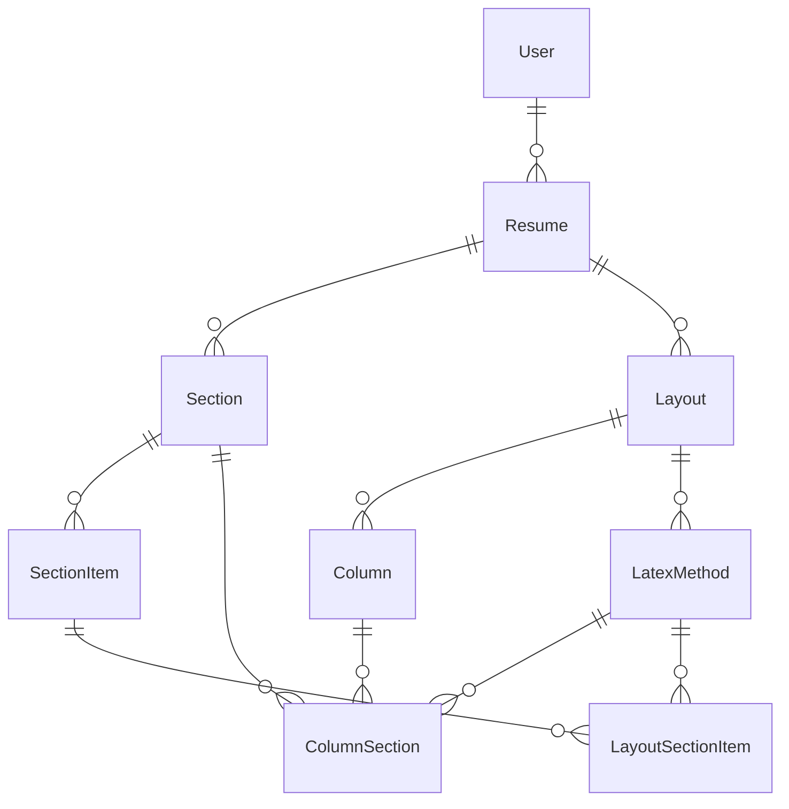

# Model of the resume structure

```mermaid
erDiagram
    User ||--o{ Resume : ""
    Resume ||--o{ Section : ""
    Section ||--o{ SectionItem : ""
    Resume ||--o{ Layout : ""
    Layout ||--o{ Column : ""
    Layout ||--o{ LatexMethod : ""
    Column ||--o{ ColumnSection : ""
    Section ||--o{ ColumnSection : ""
    LatexMethod ||--o{ ColumnSection : ""
    SectionItem ||--o{ LayoutSectionItem : ""
    LatexMethod ||--o{ LayoutSectionItem : ""
```

