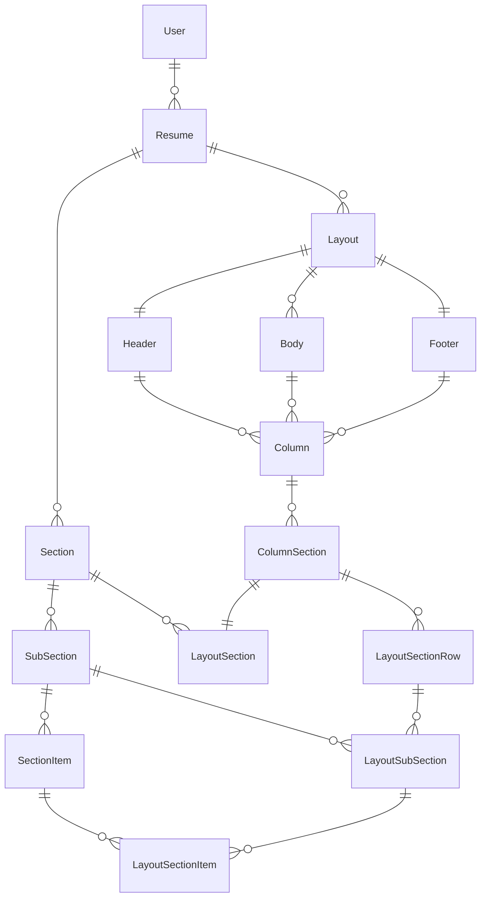

# Model of the resume structure
Here is a complete overview of the domain. All information about the resume is stored in the classes: Resume, Section, SubSection and SectionItem.

A resume can have multiple layouts, which define where, how, and which information is displayed. This can be handy for managing multiple versions of a resume depending on the application, while allowing changes to be reflected across all versions.

The Layout Classes Column, ColumnSection, LayoutSection, LayoutSectionRow, LayoutSubSection and LayoutSectionItem all implement LatexMethod. This is not shown to simplify the overview.

