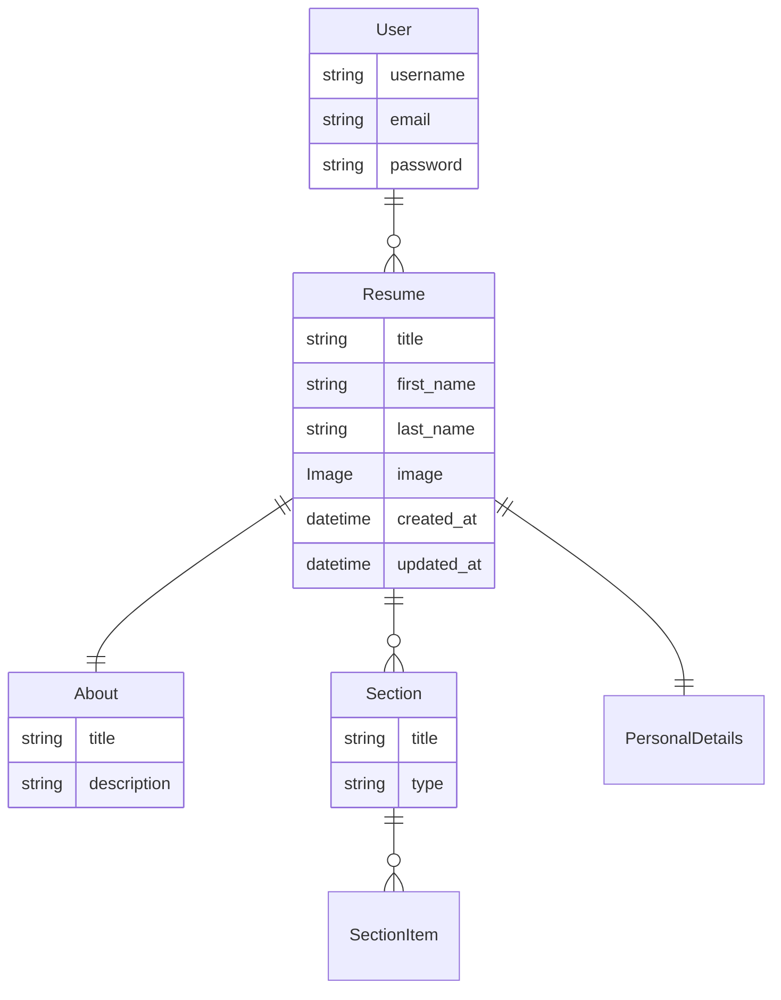
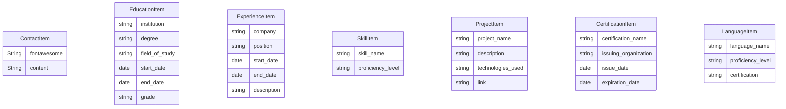

# Model of the resume structure

```mermaid
erDiagram
    User {
        string username
        string email
        string password
    }
    Resume {
        string title
        string first_name
        string last_name
        Image image
        datetime created_at
        datetime updated_at
    }
    About {
        string title
        string description
    }
    Section {
        string title
        string type
    }
    SectionItem {
    }

    User ||--o{ Resume : ""
    Resume ||--o{ Section : ""
    Resume ||--|| PersonalDetails : ""
    Resume ||--|| About : ""
    Section ||--o{ SectionItem : ""
```

## SectionItems

```mermaid
erDiagram
    
    ContactItem {
        String fontawesome
        String content    
    }

    EducationItem {
        string institution
        string degree
        string field_of_study
        date start_date
        date end_date
        string grade
    }

    ExperienceItem {
        string company
        string position
        date start_date
        date end_date
        string description
    }

    SkillItem {
        string skill_name
        string proficiency_level
    }

    ProjectItem {
        string project_name
        string description
        string technologies_used
        string link
    }

    CertificationItem {
        string certification_name
        string issuing_organization
        date issue_date
        date expiration_date
    }

    LanguageItem {
        string language_name
        string proficiency_level
        string certification
    }
```

